<p align="center">
  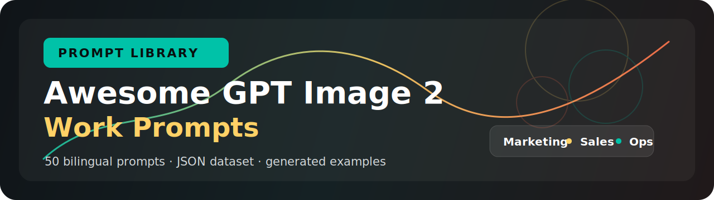
</p>

<h1 align="center">Awesome GPT Image 2 Work Prompts</h1>

<p align="center">
  <strong>100 bilingual GPT Image 2 prompts for practical work visuals.</strong><br>
  Marketing, ecommerce, sales, brand systems, operations, education, HR, customer success, community, and founder strategy.
</p>

<p align="center">
  
  
  
  
</p>

<p align="center">
  <a href="README.zh-CN.md">中文说明</a> ·
  <a href="data/prompts.json">JSON dataset</a> ·
  <a href="prompts/en">English prompts</a> ·
  <a href="prompts/zh-CN">Chinese prompts</a>
</p>

This repository is designed for builders who want prompt examples that can be used in real websites, SaaS prompt libraries, content operations, and business design workflows. Each prompt includes a structured JSON record, English and Chinese Markdown versions, and a generated PNG example image.

## Featured Prompt Examples

| Preview | Prompt |
| --- | --- |
|  | **LinkedIn launch carousel cover**<br><br>Create a bold split-layout social graphic for a B2B SaaS feature launch, with a clear headline zone, product UI fragments, three benefit chips, restrained brand motion cues, readable text, and enough negative space for website cropping.<br><br>[English](prompts/en/gptimg2-work-001-linkedin-launch-carousel-cover.md) · [中文](prompts/zh-CN/gptimg2-work-001-linkedin-launch-carousel-cover.md) |
|  | **Premium product hero shot**<br><br>Create a studio-quality ecommerce hero image for a desk accessory brand, showing material detail, scale, packaging edges, two functional callouts, premium lighting, and a clean product-focused composition.<br><br>[English](prompts/en/gptimg2-work-006-premium-product-hero-shot.md) · [中文](prompts/zh-CN/gptimg2-work-006-premium-product-hero-shot.md) |
| 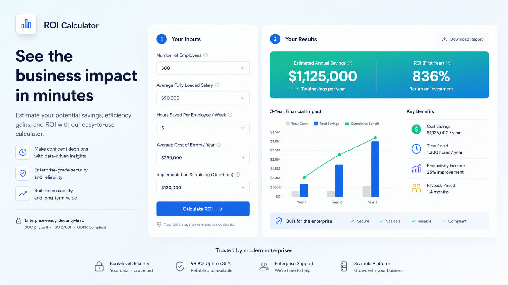 | **ROI calculator visual**<br><br>Create a dashboard-style ROI calculator visual with input fields, savings result cards, charts, trust-building enterprise details, short labels, and a layout that works as a sales page module.<br><br>[English](prompts/en/gptimg2-work-017-roi-calculator-visual.md) · [中文](prompts/zh-CN/gptimg2-work-017-roi-calculator-visual.md) |
| 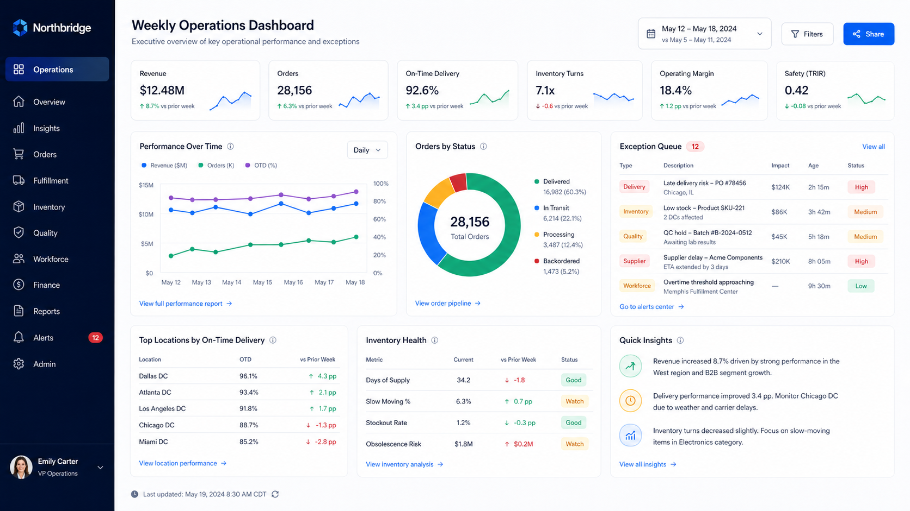 | **Weekly ops dashboard**<br><br>Create an information-dense but orderly executive dashboard with KPI cards, trend lines, anomaly queues, operational status indicators, and clear hierarchy for a weekly business update.<br><br>[English](prompts/en/gptimg2-work-026-weekly-ops-dashboard.md) · [中文](prompts/zh-CN/gptimg2-work-026-weekly-ops-dashboard.md) |
| 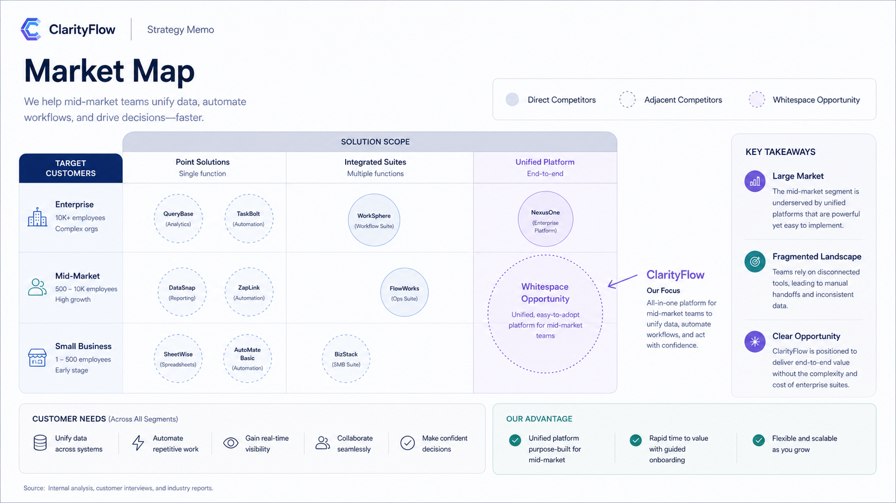 | **Market map visual**<br><br>Create a clean startup market map with category segments, whitespace opportunities, competitor placeholders, investor-readable labels, and a restrained strategy-memo visual style.<br><br>[English](prompts/en/gptimg2-work-046-market-map-visual.md) · [中文](prompts/zh-CN/gptimg2-work-046-market-map-visual.md) |
| 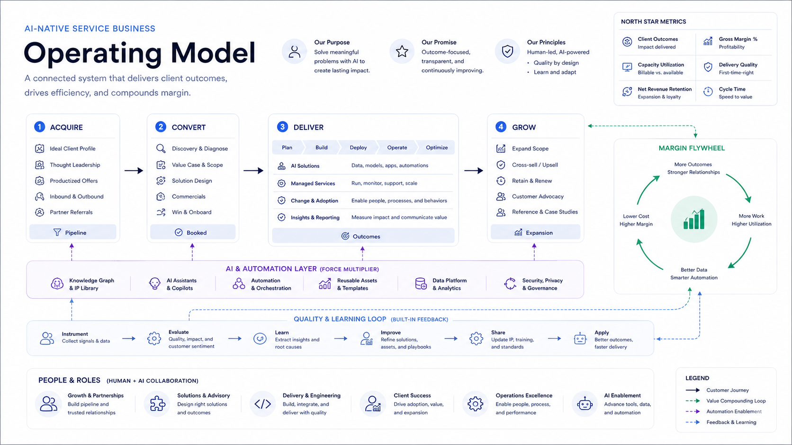 | **Operating model diagram**<br><br>Create a strategic operating model diagram for an AI-native service business, showing acquisition, delivery, automation layers, quality loops, and a profit flywheel in one coherent system view.<br><br>[English](prompts/en/gptimg2-work-050-operating-model-diagram.md) · [中文](prompts/zh-CN/gptimg2-work-050-operating-model-diagram.md) |

## Latest Additions

| Preview | Prompt |
| --- | --- |
| 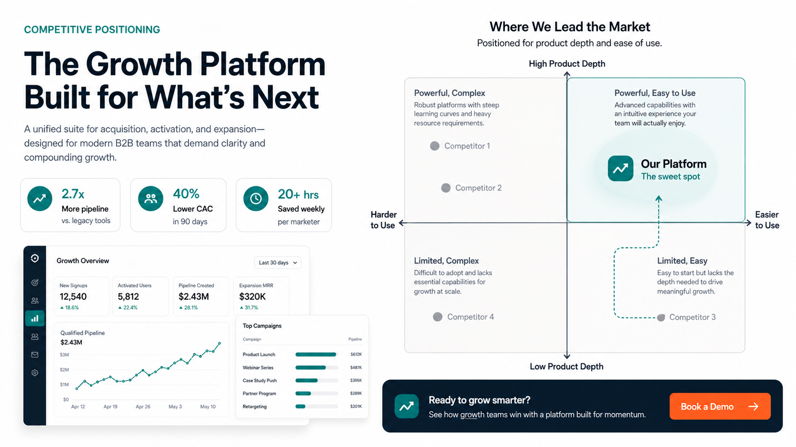 | **Competitive positioning ad matrix**<br><br>A two-axis B2B SaaS positioning visual with proof chips, competitor-neutral placeholders, product zone, dashboard fragments, and CTA strip.<br><br>[English](prompts/en/gptimg2-work-051-competitive-positioning-ad-matrix.md) · [中文](prompts/zh-CN/gptimg2-work-051-competitive-positioning-ad-matrix.md) |
| 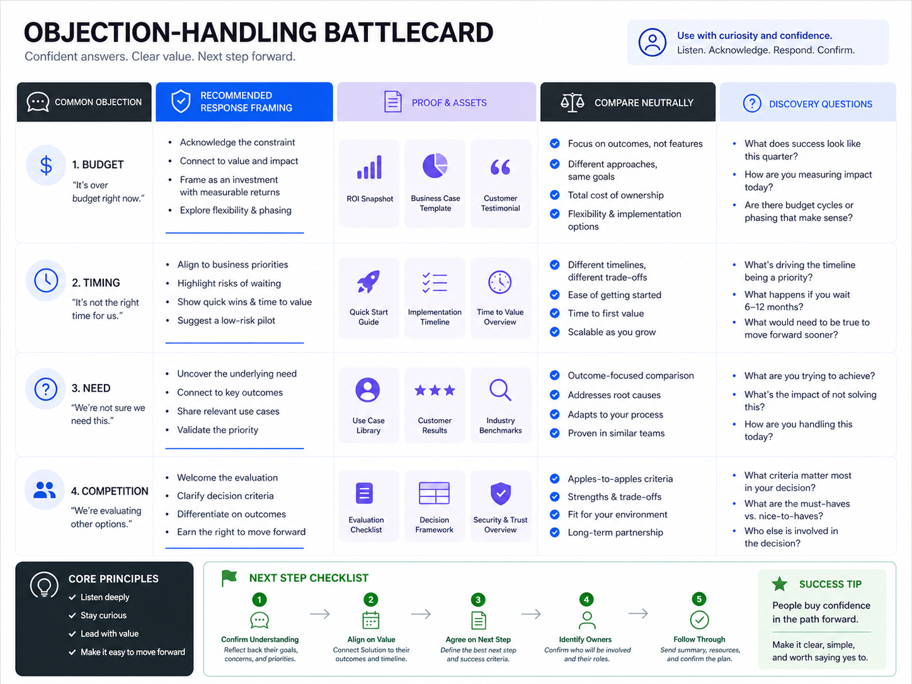 | **Sales objection-handling battlecard**<br><br>A practical sales enablement card covering budget, timing, need, and competition objections with response framing and discovery questions.<br><br>[English](prompts/en/gptimg2-work-058-sales-objection-battlecard.md) · [中文](prompts/zh-CN/gptimg2-work-058-sales-objection-battlecard.md) |
| 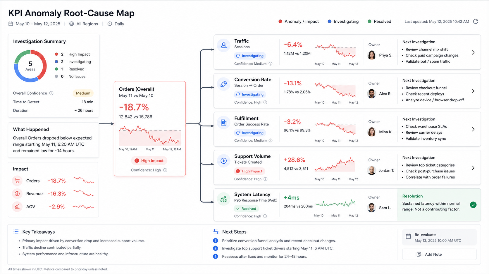 | **KPI anomaly root-cause map**<br><br>An executive-ready diagnostic map linking a KPI drop to traffic, conversion, fulfillment, support, and latency investigation branches.<br><br>[English](prompts/en/gptimg2-work-061-kpi-anomaly-root-cause-map.md) · [中文](prompts/zh-CN/gptimg2-work-061-kpi-anomaly-root-cause-map.md) |
| 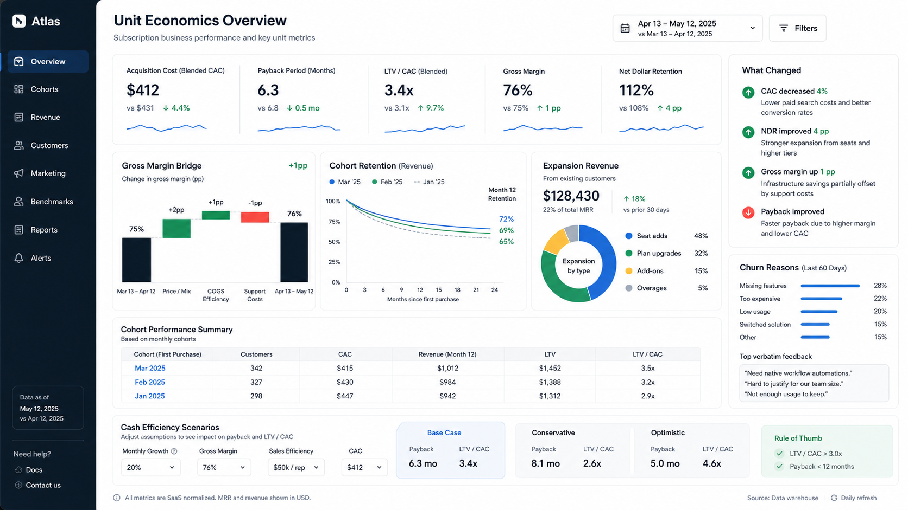 | **Unit economics founder dashboard**<br><br>An investor-ready operating dashboard for CAC, payback, margin bridge, retention, expansion revenue, churn reasons, and scenario levers.<br><br>[English](prompts/en/gptimg2-work-069-unit-economics-founder-dashboard.md) · [中文](prompts/zh-CN/gptimg2-work-069-unit-economics-founder-dashboard.md) |

## Visual Design Expansion

| Preview | Prompt |
| --- | --- |
| 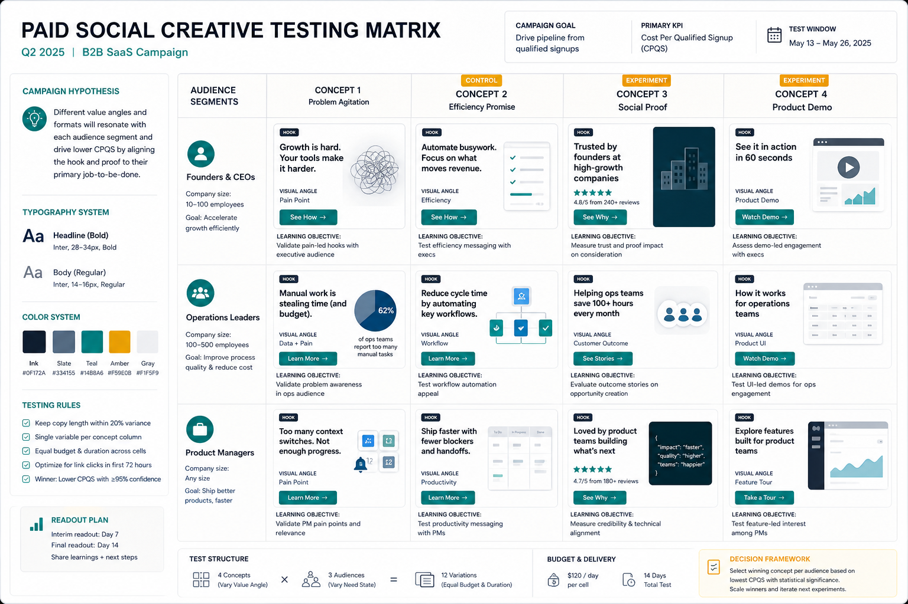 | **Paid social creative testing matrix**<br><br>A structured B2B campaign testing board with audience segments, creative concepts, hook labels, visual angle tags, CTA placeholders, and learning objectives.<br><br>[English](prompts/en/gptimg2-work-071-paid-social-creative-testing-matrix.md) · [中文](prompts/zh-CN/gptimg2-work-071-paid-social-creative-testing-matrix.md) |
| 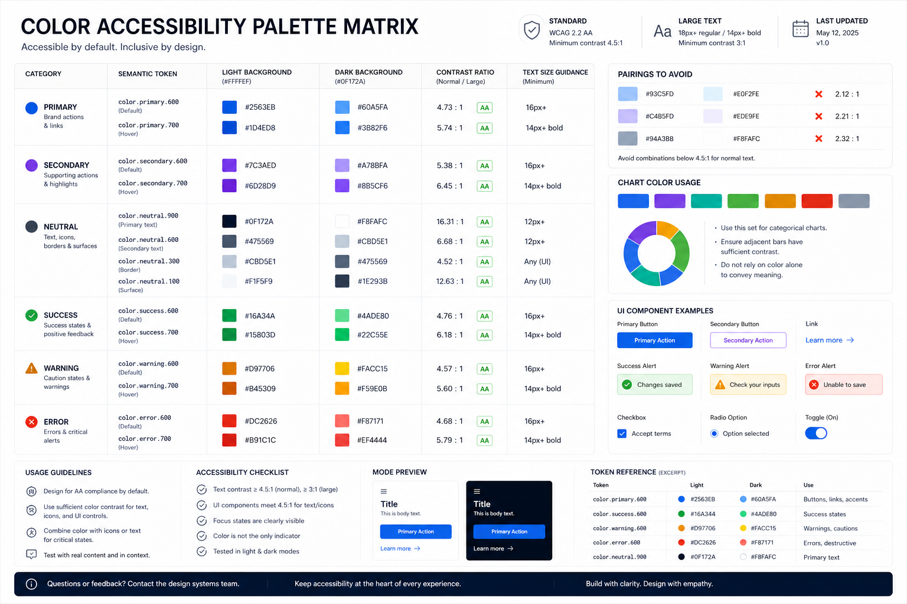 | **Color accessibility palette matrix**<br><br>A design-system color matrix covering semantic tokens, contrast badges, approved pairings, chart usage, and UI component samples.<br><br>[English](prompts/en/gptimg2-work-079-color-accessibility-palette-matrix.md) · [中文](prompts/zh-CN/gptimg2-work-079-color-accessibility-palette-matrix.md) |
| 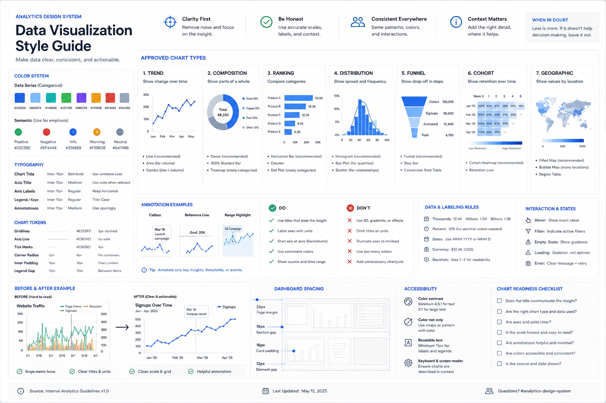 | **Data visualization style guide**<br><br>A chart governance sheet with approved chart types, axis labels, annotations, do/don’t cards, dashboard spacing tokens, and cleanup examples.<br><br>[English](prompts/en/gptimg2-work-086-data-visualization-style-guide.md) · [中文](prompts/zh-CN/gptimg2-work-086-data-visualization-style-guide.md) |
| 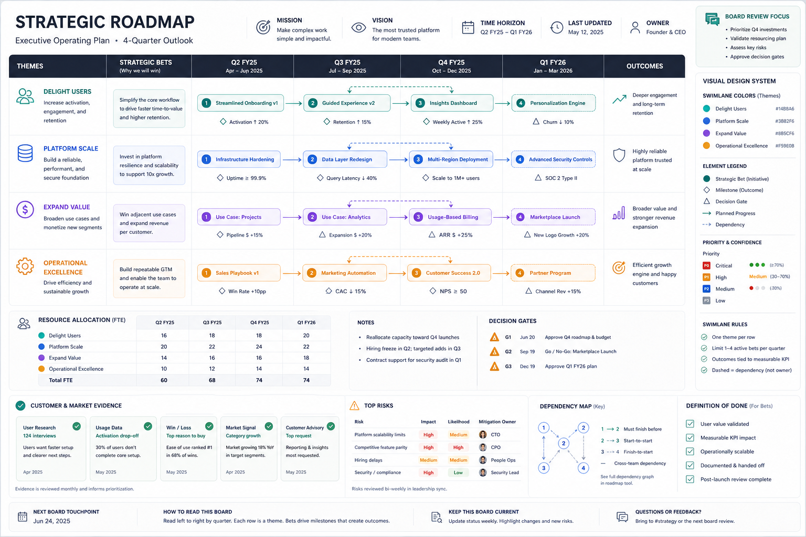 | **Strategic roadmap visual system**<br><br>A four-quarter executive roadmap system with themes, bets, milestones, evidence, dependencies, risks, decision gates, and board-review callouts.<br><br>[English](prompts/en/gptimg2-work-100-strategic-roadmap-visual-system.md) · [中文](prompts/zh-CN/gptimg2-work-100-strategic-roadmap-visual-system.md) |

## What This Repository Provides

- 100 original GPT Image 2 / ChatGPT Images 2.0 prompts for workplace use cases.
- Bilingual prompt content in English and Simplified Chinese.
- A website-friendly JSON dataset at `data/prompts.json`.
- One Markdown file per prompt under `prompts/en/` and `prompts/zh-CN/`.
- 100 generated PNG examples under `images/`.
- Category indexes for content browsing and GitHub navigation.

## Who It Is For

Use this prompt library if you are building:

- an AI prompt directory or prompt marketplace;
- a GPT Image 2 prompt gallery;
- a SaaS website with image-generation examples;
- an internal marketing, sales, HR, or operations prompt library;
- a bilingual AI tools page targeting both English and Chinese users.

## Categories

| Category | Use cases |
| --- | --- |
| Marketing & Growth | LinkedIn launch visuals, ads, email banners, app store graphics |
| Product & Ecommerce | Product hero images, listing infographics, demo visuals |
| Brand & Design System | Moodboards, design tokens, logo guides, icon direction |
| Sales & Pitch | Investor slides, ROI visuals, sales one-pagers, case studies |
| Education & Training | Microlearning cards, diagrams, workshop posters, certificates |
| Data & Operations | Dashboards, process maps, timelines, planning boards |
| HR & Internal Comms | Onboarding maps, benefits explainers, all-hands slides |
| Customer Success & Support | Help center visuals, adoption headers, escalation flows |
| Events & Community | Webinar banners, community posters, meetup covers |
| Founder & Strategy | Market maps, pricing concepts, roadmap posters, operating models |

## Dataset Format

`data/prompts.json` is the canonical source for applications and websites. Each record includes:

- `id` and `slug`
- bilingual `title`
- bilingual `category`
- bilingual `target_user`
- bilingual `use_case`
- bilingual `prompt`
- prompt structure and constraints
- `image_path`
- generation metadata without local machine paths

Example:

```json
{
  "id": "gptimg2-work-001",
  "slug": "linkedin-launch-carousel-cover",
  "category": {
    "slug": "marketing-growth",
    "en": "Marketing & Growth",
    "zh": "营销增长"
  },
  "image_path": "images/gptimg2-work-001-linkedin-launch-carousel-cover.png"
}
```

## Prompt Philosophy

The prompts are organized around user work needs rather than entertainment styles. The goal is to make every prompt usable as a business asset request: it should define the audience, deliverable, visual layout, text rules, composition constraints, and negative constraints.

These prompts are original rewrites synthesized from public research into GPT Image 2 prompt patterns. Public community collections, X discussions, GitHub lists, and prompt galleries were used for inspiration and taxonomy only; this repository does not copy third-party prompts verbatim.

## SEO And GEO Notes

This repository targets search intents such as:

- GPT Image 2 prompts
- ChatGPT Images 2.0 prompts
- GPT Image 2 prompt examples
- AI image prompts for work
- business AI image generation prompts
- bilingual AI image prompt dataset
- prompt library JSON for websites

For generative engine optimization, the content is written in an answer-first structure with clear category names, direct use cases, reusable JSON, and explicit source policy. This makes the repository easier for AI search engines and answer engines to cite accurately.

## Repository Structure

```text
.
├── categories/
├── assets/
├── data/
│   ├── prompts.json
│   └── sources.json
├── images/
├── prompts/
│   ├── en/
│   └── zh-CN/
├── CONTRIBUTING.md
├── LICENSE
├── README.md
├── README.zh-CN.md
└── SECURITY.md
```

## Model Naming

The public naming around the release uses both `GPT Image 2` and `ChatGPT Images 2.0`. This repository keeps both terms in the metadata so the dataset can work for developer documentation, website pages, and prompt-library search.

## License

See [LICENSE](LICENSE).
